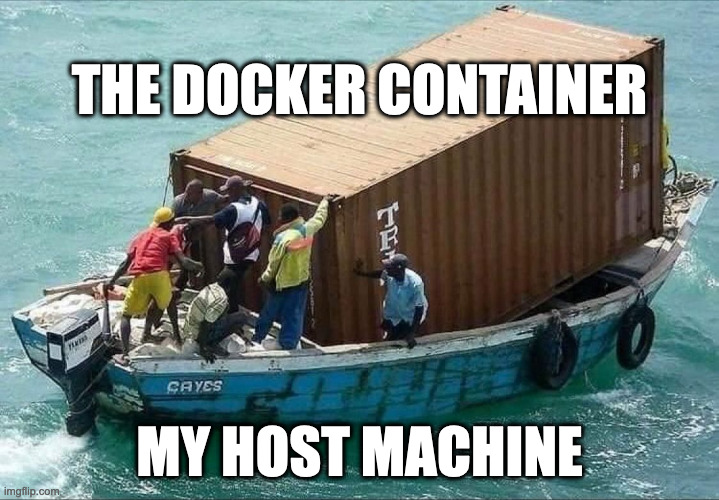

# TP1 : Premiers pas Docker

Dans ce TP on va appréhender les bases de Docker.

Etant fondamentalement une techno Linux, **vous réaliserez le TP sur une VM Linux** (ou sur votre poste si vous êtes sur Linux).

> *Oui oui les dévs, on utilisera Docker avec vos Windows/MacOS plus tard. Là on va se concentrer sur l'essence du truc.*

## Sommaire

- [TP1 : Premiers pas Docker](#tp1--premiers-pas-docker)
  - [Sommaire](#sommaire)
- [0. Setup](#0-setup)
- [I. Init](#i-init)
- [II. Images](#ii-images)
- [III. Docker compose](#iii-docker-compose)

# 0. Setup

➜ **Munissez-vous du [mémo Docker](../../cours/memo/docker.md)**

➜ **Une VM Rocky Linux sitoplé, une seul suffit**

- met lui une carte host-only pour pouvoir SSH dessus
- et une carte NAT pour un accès internet

➜ **Checklist habituelle :**

- [x] IP locale, statique ou dynamique
- [x] hostname défini
- [x] SSH fonctionnel
- [x] accès Internet
- [x] résolution de nom
- [x] SELinux en mode *"permissive"* vérifiez avec `sestatus`, voir [mémo install VM tout en bas](../../cours/memo/install_vm.md)

# I. Init

[Document dédié aux premiers pas Docker.](./init.md)

# II. Images

[Document dédié à la gestion/création d'images Docker.](./image.md)

# III. Docker compose

[Document dédié à l'utilisation de `docker-compose`.](./compose.md)
