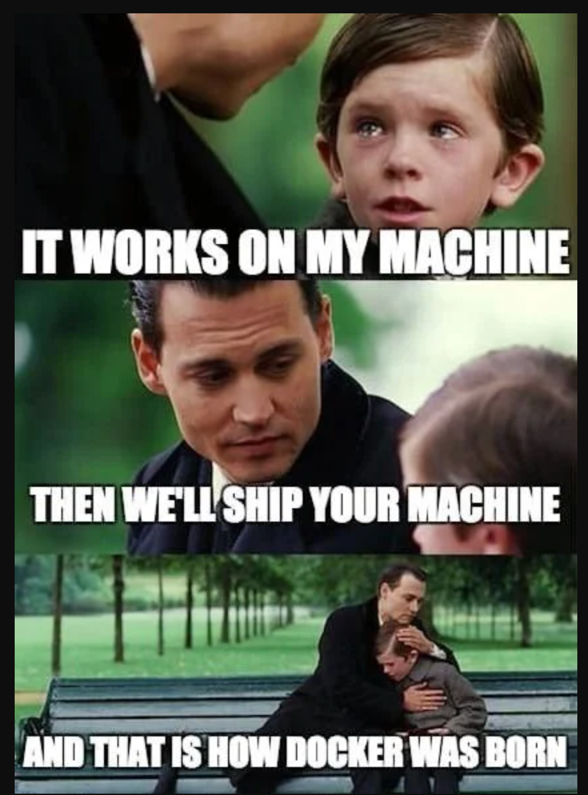

# TP2 dév : packaging et environnement de dév local

Une fois que tu sais bien manipuler Docker, tu peux :

- dév sur ton PC avec ton IDE préféré
- run ton code dans des conteneurs éphémères
- avoir des services sur lesquels reposent ton code dans des conteneurs éphémères (genre une base de données)
- n'avoir littéralement
  - AUCUN langage ni aucune lib installés sur ta machine
  - aucun service en local ni dans une VM (une base de données par exemple)

Concrètement, Docker ça te permet donc surtout de :

➜ **avoir 150k environnements de dév à ta portée**

- une commande `docker run` et PAF t'as un new langage
- dans une version spécifique
- avec des libs spécifiques
- dans des versions spécifiques

➜ **ne pas pourrir ta machine**

- dès que t'as plus besoin d'exécuter ton code...
- ...tu détruis le conteneur
- ce sera très simple d'en relancer un demain pour continuer à dév
- quand tu dév, t'as l'env qui existe, quand tu dév pas, il existe plus
- mais tu perds 0 temps dans la foulée

> 0,5 sec le temps de `docker run` my bad. Si c'est ça le coût de la manoeuvre...

➜ **t'abstraire de ton environnement à toi**

- tu crées un environnement isolé avec sa logique qui n'est pas celle de ton système hôte
- donc on s'en fout de ce qu'il y a sur ton hôte, c'est isolé
- je pense aux dévs sous Windows qui ont install' plusieurs Go de libs pour juste `aiohttp` en cours parce que Windows l'a décidé :x

➜ **partager ton environnement**

- bah ouais t'as juste à filer ton `Dockerfile` et ton `docker-compose.yml`
- et n'importe qui peut exécuter ton code dans le même environnement que toi
- n'importe qui c'est principalement :
  - d'autres dévs avec qui tu dév
  - des admins qui vont héberger ton app
  - des randoms qui trouvent ton projet github cool

➜ **pop des services éphémères**

- genre si ton app a besoin d'une db
- c'est facile d'en pop une en une seule commande dans un conteneur
- la db est dispo depuis ton poste
- et tu détruis le conteneur quand tu dév plus



## Sommaire

- [TP2 dév : packaging et environnement de dév local](#tp2-dév--packaging-et-environnement-de-dév-local)
  - [Sommaire](#sommaire)
- [I. Packaging](#i-packaging)
  - [1. Calculatrice](#1-calculatrice)
  - [2. Chat room](#2-chat-room)

# I. Packaging

## 1. Calculatrice

🌞 **Packager l'application de calculatrice réseau**

- packaging du serveur, pas le client
- créer un répertoire `calc_build/` dans votre dépôt git de rendu
- créer un `Dockerfile` qui permet de build l'image
- créer un `docker-compose.yml` qui permet de l'ancer un conteneur calculatrice
- écrire vitefé un `README.md` qui indique les commandes pour build et run l'app

🌞 **Environnement : adapter le code si besoin**

- on doit pouvoir choisir sur quel port écoute la calculatrice si on définit la variable d'environnement `CALC_PORT`
- votre code doit donc :
  - récupérer la valeur de la variable d'environnement `CALC_PORT` si elle existe
  - vous devez vérifier que c'est un entier
  - écouter sur ce port là
- ainsi, on peut choisir le port d'écoute comme ça avec `docker run` :

```bash
$ docker run -e CALC_PORT=6767 -d calc
```

🌞 **Logs : adapter le code si besoin**

- tous les logs de la calculatrice DOIVENT sortir en sortie standard
- en effet, il est courant qu'un conteneur génère tous ses logs en sortie standard
- on peut ensuite les consulter avec `docker logs`

📜 **Dossier `tp2/calc/` dans le dépôt git de rendu**

- `Dockerfile`
- `docker-compose.yml`
- `README.md`
- `calc.py` : le code de l'app calculatrice

## 2. Chat room


🌞 **Packager l'application de chat room**

- pareil : on package le serveur
- `Dockerfile` et `docker-compose.yml`
- code adapté :
  - logs en sortie standard
  - variable d'environnement `CHAT_PORT` pour le port d'écoute
  - variable d'environnement `MAX_USERS` pour limiter le nombre de users dans chaque room (ou la room s'il y en a qu'une)
- encore un README propre qui montre comment build et comment run (en démontrant l'utilisation des variables d'environnement)

📜 **Dossier `tp2/chat/` dans le dépôt git de rendu**

- `Dockerfile`
- `docker-compose.yml`
- `README.md`
- `chat.py` : le code de l'app chat room

➜ **J'espère que ces cours vous ont apporté du recul sur la relation client/serveur**

- deux programmes distincts, chacun a son rôle
  - le serveur
    - est le gardien de la logique, le maître du jeu, garant du respect des règles
    - c'est votre bébé vous le maîtrisez
    - opti et sécu en tête
  - le client c'est... le client
    - faut juste qu'il soit joooooli
    - garder à l'esprit que n'importe qui peut le modifier ou l'adapter
    - ou carrément dév son propre client
- y'a même des milieux comme le web, où les gars qui dév les serveurs (Apache, NGINX, etc) c'est pas DU TOUT les mêmes qui dévs les clients (navigateurs Web, `curl`, librairie `requests` en Python, etc)
