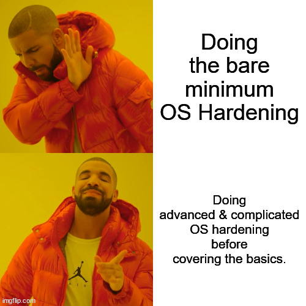
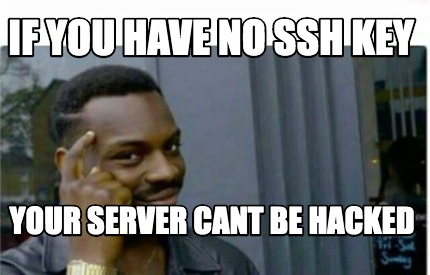

# TP3 : Linux Hardening

**Dans ce TP, vous allez renforcer la sécurité d'un OS Linux.**

Le sujet du TP va être court car je ne vais pas réinventer la roue, et je vais vous renvoyer vers des ressources fiables.

## Sommaire

- [TP3 : Linux Hardening](#tp3--linux-hardening)
  - [Sommaire](#sommaire)
  - [0. Setup](#0-setup)
  - [1. Guides CIS](#1-guides-cis)
  - [2. Conf SSH](#2-conf-ssh)
  - [4. DoT](#4-dot)
  - [5. AIDE](#5-aide)

## 0. Setup

Vous utiliserez une VM Rocky Linux pour dérouler ce TP.

## 1. Guides CIS

CIS est une boîte qui notamment édite des guides de configuration

- assez réputés
- pour sécuriser les installations des OS courants
- notamment les OS Linux

🌞 **Suivre un guide CIS**

- téléchargez le guide CIS de Rocky 9 [ici](https://downloads.cisecurity.org/#/)
- vous devez faire :
  - la section 2.1
  - les sections 3.1 3.2 et 3.3
  - toute la section 5.2 Configure SSH Server
  - au moins 10 points dans la section 6.1 System File Permissions
  - au moins 10 points ailleur sur un truc que vous trouvez utile

> Le but c'est pas de rush mais comprendre ce que vous faites, comprendre ici pourquoi c'est important de vérifier que ces trucs sont activés ou désactivés. Et très bon pour votre culture.

## 2. Conf SSH

🌞 **Chiffrement fort côté serveur**

- trouver une ressource de confiance (je veux le lien en compte-rendu)
- configurer le serveur SSH pour qu'il utilise des paramètres forts en terme de chiffrement (je veux le fichier de conf dans le compte-rendu)
  - conf dans le fichier de conf
  - regénérer des clés pour le serveur ?
  - regénérer les paramètres Diffie-Hellman ? (se renseigner sur Diffie-Hellman ?)

🌞 **Clés de chiffrement fortes pour le client**

- trouver une ressource de confiance (je veux le lien en compte-rendu)
- générez-vous une paire de clés qui utilise un chiffrement fort et une passphrase
- ne soyez pas non plus absurdes dans le choix du chiffrement quand je dis "fort" (genre pas de RSA avec une clé de taile 98789080932083209 bytes)

🌞 **Connectez-vous en SSH à votre VM avec cette paire de clés**

- prouvez en ajoutant `-vvvv` sur la commande `ssh` de connexion que vous utilisez bien cette clé là

## 4. DoT

Ca commence à faire quelques années maintenant que plusieurs acteurs poussent pour qu'on fasse du DNS chiffré, et qu'on arrête d'envoyer des requêtes DNS en clair dans tous les sens.

Le Dot est une techno qui va dans ce sens : DoT pour DNS over TLS. On fait nos requêtes DNS dans des tunnels chiffrés avec le protocole TLS.

🌞 **Configurer la machine pour qu'elle fasse du DoT**

- installez `systemd-resolved` sur la machine pour ça
- activez aussi DNSSEC tant qu'on y est
- [référez-vous à cette doc qui est cool par exemple](https://wiki.archlinux.org/title/systemd-resolved)
- utilisez le serveur public de CloudFlare : 1.1.1.1 (il supporte le DoT)

> Donc normalement : install du paquet, modif du fichier `/etc/systemd/resolved.conf` pour activer le DoT, activer DNSSEC et utiliser `1.1.1.1`, puis une commande pour modifier le contenu de `/etc/resolv.conf`, et enfin, redémarrer le service `systemd-resoved`.

🌞 **Prouvez que les requêtes DNS effectuées par la machine...**

- ont une réponse qui provient du serveur que vous avez conf (normalement c'est `127.0.0.1` avec `systemd-networkd` qui tourne)
  - quand on fait un `dig ynov.com` on voit en bas quel serveur a répondu
- mais qu'en réalité, la requête a été forward vers 1.1.1.1 avec du TLS
  - je veux une capture Wireshark à l'appui !

## 5. AIDE

Un truc demandé au point 1.3.1 du guide CIS c'est d'installer AIDE.

AIDE est un IDS ou *Intrusion Detection System*. Les IDS c'est un type de programme dont les fonctions peuvent être multiples.

Dans notre cas, AIDE, il surveille que certains fichiers du disque n'ont pas été modifiés. Des fichiers comme `/etc/shadow` par exemple.

🌞 **Installer et configurer AIDE**

- et bah incroyable mais [une très bonne ressource ici](https://www.it-connect.fr/aide-utilisation-et-configuration-dune-solution-de-controle-dintegrite-sous-linux/)
- configurez AIDE pour qu'il surveille (fichier de conf en compte-rendu)
  - le fichier de conf du serveur SSH
  - le fichier de conf du client chrony (le service qui gère le temps)
  - le fichier de conf de `systemd-networkd`

🌞 **Scénario de modification**

- introduisez une modification dans le fichier de conf du serveur SSH
- montrez que AIDE peut la détecter

🌞 **Timer et service systemd**

- créez un service systemd qui exécute un check AIDE
  - il faut créer un fichier `.service` dans le dossier `/etc/systemd/system/`
  - contenu du fichier à montrer dans le compte rendu
- créez un timer systemd qui exécute un check AIDE toutes les 10 minutes
  - il faut créer un fichier `.timer` dans le dossier `/etc/systemd/system/`
  - il doit porter le même nom que le service, genre `aide.service` et `aide.timer`
  - c'est complètement irréaliste 10 minutes, mais ça vous permettra de faire des tests (vous pouvez même raccourcir encore)
